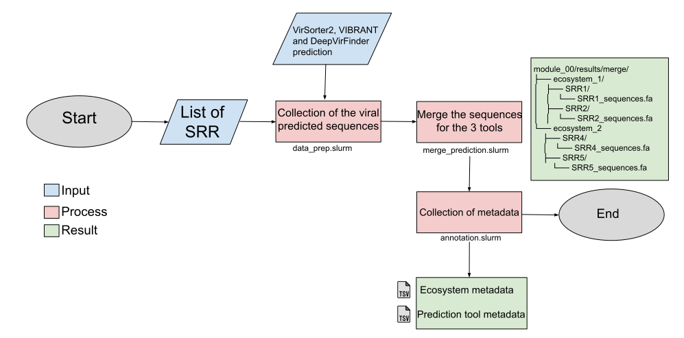

#       Welcome to the module number zero !      

<p align="center">
  
</p>

This module aims to pre-process the results from the three prediction tool : VIBRANT, DeepVirFinder and VirSorter2.
The viral predictions are collected and the viral contig sequences are re-created thanks to the assembling data.
Make sure you have the assembling data !

## Requirements

ATTENTION, to perform the script for the first time. You'll have to modify the different pathways. No worry, everything is commented.
You just have to modify the "TO MODIFY FOR FIRST USE" part at the beginning of the script.
To modify it : 
```
nano module_00/bin/data_prep.slurm
```

Then you have to make sure you have the correct directory structure for your different path.
For the results of your predictions, for each tool, you should have something like this :
```
results/
├── VirSorter2/
│   ├── ecosystem1/
│   │   ├── SRR1/
│   │   └── SRR2/
│   └── ecosystem2/
│       ├── SRR3/
│       └── SRR4/
├── Vibrant/
│   ├── ecosystem1/
│   │   ├── SRR1/
│   │   └── SRR2/
│   └── ecosystem2/
│       ├── SRR3/
│       └── SRR4/
└── DeepVirFinder/
    ├── ecosystem1/
    │   ├── SRR1/
    │   └── SRR2/
    └── ecosystem2/
        ├── SRR3/
        └── SRR4/
```

For the assembling data pathway, you should have a directory structure like this :
```
assembling/
├── ecosystem1/
│   ├── SRR1.fasta.gz
│   ├── SRR2.fasta.gz
│   └── SRR3.fasta.gz
├── ecosystem2/
│   ├── SRR4.fasta.gz
│   ├── SRR5.fasta.gz
│   └── SRR6.fasta.gz
└── ecosystem3/
    ├── SRR7.fasta.gz
    ├── SRR8.fasta.gz
    └── SRR9.fasta.gz
```

The last requirements is a list of your SRR that you want to process. This list should be in a .txt format like this :
```
ERR3230156
K7GSL311029
MCMSL335680
SRR6050903
SRR6050920
SRR6050921
```

## Usage

The **first** step is to collect the viral sequences from the prediction results. Make sure to write the correct path of your SRR list.
```
sbatch -p fast -q fast module_00/bin/data_prep.slurm YourListofSRR.txt
```

The **second** step is to merge the 3 sequences file from the 3 different prediction tools for each SRR. At the end, you will have only one fasta file per SRR.
This step also include an annotation step to keep the prediction tool metadata for each contig.
```
sbatch -p fast -q fast module_00/bin/merge_prediction.slurm
```

The **third** step is to finalish the annotation. All the annotations made before (during step two) will be merged into two metadata files. One for the
prediction tool and one for the ecosystem (relative to each contig).
```
sbatch -p fast -q fast module_00/bin/annotation.slurm
```


## Results 
As a result of the **first** step you should have a directory structure like this : 
```
result/
├── ecosystem_1/
│   ├── SRR1/
│   │   ├── vs2_prediction.fa
│   │   ├── vib_prediction.fa
│   │   └── dvf_prediction.fa
│   └── ...
└── ecosystem_2/
    ├── SRR2/
    │   ├── vs2_prediction.fa
    │   ├── vib_prediction.fa
    │   └── dvf_prediction.fa
    └── ...
```

As a result of the **second** step you should have a directory structure like this : 
```
module_00/results/merge/
├── ecosystem_1/
│   ├── SRR1/
│   │   └── SRR1_sequences.fa
│   ├── SRR2/
│   │   └── SRR2_sequences.fa
│   └── SRR3/
│       └── SRR3_sequences.fa
└── ecosystem_2
    ├── SRR4/
    │   └── SRR4_sequences.fa
    ├── SRR5/
    │   └── SRR5_sequences.fa
    └── SRR6/
        └── SRR6_sequences.fa
```

As a result of the **third** step you should have two files like these : 
```
$ cat module_00/results/annotation/contig_eco_list.tsv | head
ERR3230156_240481==air
ERR3230156_111360==air
ERR3230156_185297==air
ERR3230156_333266==air
ERR3230156_370292==air
ERR3230156_388916==air
ERR3230156_148612==air
ERR3230156_426215==air
ERR3230156_518683==air
ERR3230156_574273==air

$ cat module_00/results/annotation/contig_tools_list.tsv | head
ERR3230156_240481	dvf
ERR3230156_111360	dvf
ERR3230156_185297	dvf
ERR3230156_333266	dvf
ERR3230156_370292	dvf
ERR3230156_388916	dvf
ERR3230156_148612	dvf
ERR3230156_426215	dvf
ERR3230156_518683	dvf
ERR3230156_574273	dvf
```


