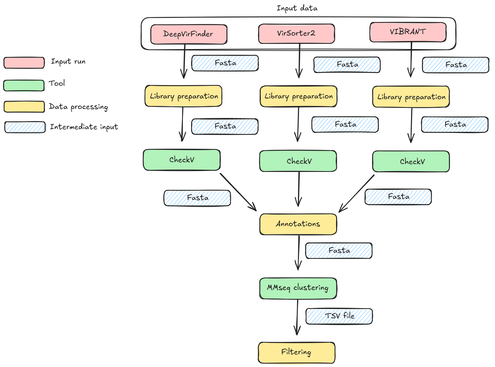

# 🎈 🎈 🎈 Welcome to the module number one ! 🎈 🎈 🎈 

This first module includes the steps of quality control of the predicted viral contigs. 

<p align="center">
  
</p>


## Requirements

First, you need to be sure that you have the correct files. I suggest you to look after the data_prep/ or data_test/ folders.
You should have a result folder like this : 
I suggest you to look forward the module_00 for more informations.

```
module_00/results/merge/
├── ecosystem_1/
│   ├── SRR1/
│   │   └── SRR1_sequences.fa
│   ├── SRR2/
│   │   └── SRR2_sequences.fa
│   └── SRR3/
│       └── SRR3_sequences.fa
└── ecosystem_2
    ├── SRR4/
    │   └── SRR4_sequences.fa
    ├── SRR5/
    │   └── SRR5_sequences.fa
    └── SRR6/
	└── SRR6_sequences.fa
```

You will probably have to modify the paths in the scripts.

I suggest you to work on a HPC because this step can take a while...
For this module, you will need of some programs on your machine.

Firstly, Singularity v.3.7.4 is used. I suggest you to read the [documentation](https://docs.sylabs.io/guides/3.0/user-guide/installation.html).

Check if you have Singularity already installed on your machine :
```bash
singularity --version
```
If not :
```bash
sudo apt update
sudo apt install singularity-container
```

Then, you have to install CheckV (v1.0.1) via singularity :
```bash
singularity pull docker://antoniopcamargo/checkv:latest
```

Finally, we are also using MMseq2 for clustering :
We are using (MMseqs2)[https://github.com/soedinglab/MMseqs2] Version: 24479bc27c3f33a3c0121f916038c605beef3e79.
```
# install by brew
brew install mmseqs2
# install via conda
conda install -c conda-forge -c bioconda mmseqs2
# install docker
docker pull ghcr.io/soedinglab/mmseqs2
# MMseqs2-GPU mostly-static AVX2 build requiring glibc >= 2.29 and nvidia driver >=525.60.13 (see below)
wget https://mmseqs.com/latest/mmseqs-linux-gpu.tar.gz; tar xvfz mmseqs-linux-gpu.tar.gz; export PATH=$(pwd)/mmseqs/bin/:$PATH
# static build with AVX2 (fastest)
wget https://mmseqs.com/latest/mmseqs-linux-avx2.tar.gz; tar xvfz mmseqs-linux-avx2.tar.gz; export PATH=$(pwd)/mmseqs/bin/:$PATH
# static build with SSE4.1
wget https://mmseqs.com/latest/mmseqs-linux-sse41.tar.gz; tar xvfz mmseqs-linux-sse41.tar.gz; export PATH=$(pwd)/mmseqs/bin/:$PATH
# static build with SSE2 (slowest, for very old systems)
wget https://mmseqs.com/latest/mmseqs-linux-sse2.tar.gz; tar xvfz mmseqs-linux-sse2.tar.gz; export PATH=$(pwd)/mmseqs/bin/:$PATH
```
I recommend you to have conda on your machine 
```
wget https://repo.anaconda.com/miniconda/Miniconda3-latest-Linux-x86_64.sh -O miniconda.sh
bash miniconda.sh
source ~/.bashrc

## Usage

### The **first step** is to run the CheckV tool for each SRR fasta file.

If you are working on a HPC (recommended) :
```
sbatch -p fast -q fast module_01/checkV/bin/qc_checkv.slurm
```
This script needs the results from the module_00 structured like this :

```
module_00/results/merge/
├── ecosystem_1/
│   ├── SRR1/
│   │   └── SRR1_sequences.fa
│   ├── SRR2/
│   │   └── SRR2_sequences.fa
│   └── SRR3/
│       └── SRR3_sequences.fa
└── ecosystem_2
    ├── SRR4/
    │   └── SRR4_sequences.fa
    ├── SRR5/
    │   └── SRR5_sequences.fa
    └── SRR6/
	└── SRR6_sequences.fa
```
At the end of this **first** step, you should have a structure like this :
```
module_01/results/checkv/
├── ecosystem_1
│   ├── ERR3230156
│   │   └── ERR3230156_sequences_checkV
│   │       ├── complete_genomes.tsv
│   │       ├── completeness.tsv
│   │       ├── contamination.tsv
│   │       ├── proviruses.fna
│   │       ├── quality_summary.tsv
│   │       ├── tmp
│   │       └── viruses.fna
│   └── K7GSL311029
│       └── K7GSL311029_sequences_checkV
│           ├── complete_genomes.tsv
│           ├── completeness.tsv
│           ├── contamination.tsv
│           ├── proviruses.fna
│           ├── quality_summary.tsv
│           ├── tmp
│           └── viruses.fna
└── ecosystem_2
    ├── SRR6050903
    │   └── SRR6050903_sequences_checkV
    │       ├── complete_genomes.tsv
    │       ├── completeness.tsv
    │       ├── contamination.tsv
    │       ├── proviruses.fna
    │       ├── quality_summary.tsv
    │       ├── tmp
    │       └── viruses.fna
    └── SRR6050920
        └── SRR6050920_sequences_checkV
            ├── complete_genomes.tsv
            ├── completeness.tsv
            ├── contamination.tsv
            ├── proviruses.fna
            ├── quality_summary.tsv
            ├── tmp
            └── viruses.fna
```

### The **second step** is to annotate the contigs and regroups the cleaned viral sequences.

If you are working on a HPC : 
```bash
./module_01/annotate/bin/annotate.slurm
```

As entry, you needs the result structure from the **first** step. 
At the end, you should have one Fasta file containing all the cleaned viral sequences from CheckV analysis.
This Fasta file will be used for clustering in the next step.
```
module_01/annotate/results/
└── all_annotated_contigs.fasta
```

### The **third step** is to cluster the different contigs. The MMseq2 tool is used to cluster the annotate sequences.

If you are working on a HPC (recommended) :
```bash
./module_01/MMseq2/bin/clustering.slurm
```
As entry, this script is using the all_annotated_contigs.fasta file created just before in **second** step.
At the end of the clustering, you should have something like this :
```
huserville/module_01/mmseq2/results/
├── clusterRes_all_seqs.fasta
├── clusterRes_cluster.tsv
├── clusterRes_rep_seq.fasta
└── tmp
    └── 15354580863310092783
        ├── clu_tmp
        │   └── 14992683302536304478
        │       └── linclust.sh
        ├── easycluster.sh
        ├── input.dbtype
        ├── input.index
        ├── input.source
        ├── input_h.dbtype
        └── input_h.index
```

### The **forth step** is the exploration and the filtration of the clustering results. At the end, only clusters with contigs predicted by at least 2 different prediction tools will
be keep for the next  analysis. 
```
sbatch populate_table.slurm 
sbatch -p fast -q fast filtering.slurm
```
For this script, you will need different variables. 
1. The path to the results from CheckV analysis.
2. The path to the contig_tools_list.tsv file created in module_00.
3. The path to the clusterRes_cluster.tsv file created just before during clustering.

At the end of the populate AND filtering, you should have something like that :
```
huserville/module_01/filtering/results/
├── eco1_filtered_representative_cluster.tsv
├── eco2_filtered_representative_cluster.tsv
├── eco3_filtered_representative_cluster.tsv
├── eco4_filtered_representative_cluster.tsv
```

The results are TSV file for each ecosystem. All the TSV file looks like that :
| Representative_contig   | cluster_size | vs2_seed | vibrant_seed | dvf_seed | vs2_cluster | vibrant_cluster | dvf_cluster | checkv_quality  | completeness | seed_length | provirus_seed |
|--------------------------|--------------|----------|--------------|----------|-------------|-----------------|-------------|-----------------|--------------|-------------|---------------|
| 7KYSL273102_1            | 9            | 1        | 0            | 1        | 1           | 0               | 8           | Low-quality     | 1.16         | 3792.0      | Yes           |
| BCN-094-29786_4          | 32           | 1        | 0            | 1        | 28          | 0               | 30          | Not-determined  |              | 10435.0     | No            |
| ERR3230156_100082        | 3            | 1        | 1            | 1        | 0           | 0               | 0           | Low-quality     | 7.5          | 4492.0      | No            |
| ERR3230156_111360        | 3            | 1        | 1            | 1        | 0           | 0               | 0           | Low-quality     | 7.46         | 5467.0      | No            |
| ERR3230156_169427        | 2            | 1        | 0            | 1        | 0           | 0               | 0           | Medium-quality  | 82.65        | 5615.0      | No            |
| ERR3230156_247723        | 2            | 1        | 0            | 1        | 0           | 0               | 0           | Not-determined  |              | 3875.0      | No            |
| ERR3230156_270015        | 2            | 1        | 0            | 1        | 0           | 0               | 0           | Not-determined  |              | 5575.0      | No            |
| ERR3230156_287436        | 2            | 1        | 1            | 0        | 0           | 0               | 0           | Low-quality     | 9.02         | 3789.0      | No            |
| ERR3230156_289942        | 2            | 1        | 1            | 0        | 0           | 0               | 0           | Low-quality     | 32.91        | 3932.0      | No            |


## Computational analysis 
This computational analysis has been performed on the subdataset created by the data_test/ folder. This dataset is containing approximately 180,000 contigs.
The total volume of input data was 1.5 Go. 

Here are the results collected working with shell (no HPC) : 
1. CheckV : time : around 6 hours (number of CPUs used here : 16). For a 1.5Go of inputs, the total volume of the outputs is 20Go.
2. MMseq2 : time : around 40 s for a 1.4Go of inputs corresponding of the test dataset.

Here are the results collected working with HPC :
1. For the CheckV analysis, the fast partition is enough (max time : 4 hours, 8 CPUs per task). All the run inputs are parallelized.
2. For the annotation step, the fast partition is enough (max time : 4 hours, 8	CPUs per task). No parallelization here.
3. For the clustering step, the	fast partition is enough (max time : 4 hours, 8 CPUs per task).	No parallelization here.
4. For the populate table and filtering steps : the long partition is required (more than 24 hours). No parallelization here.

