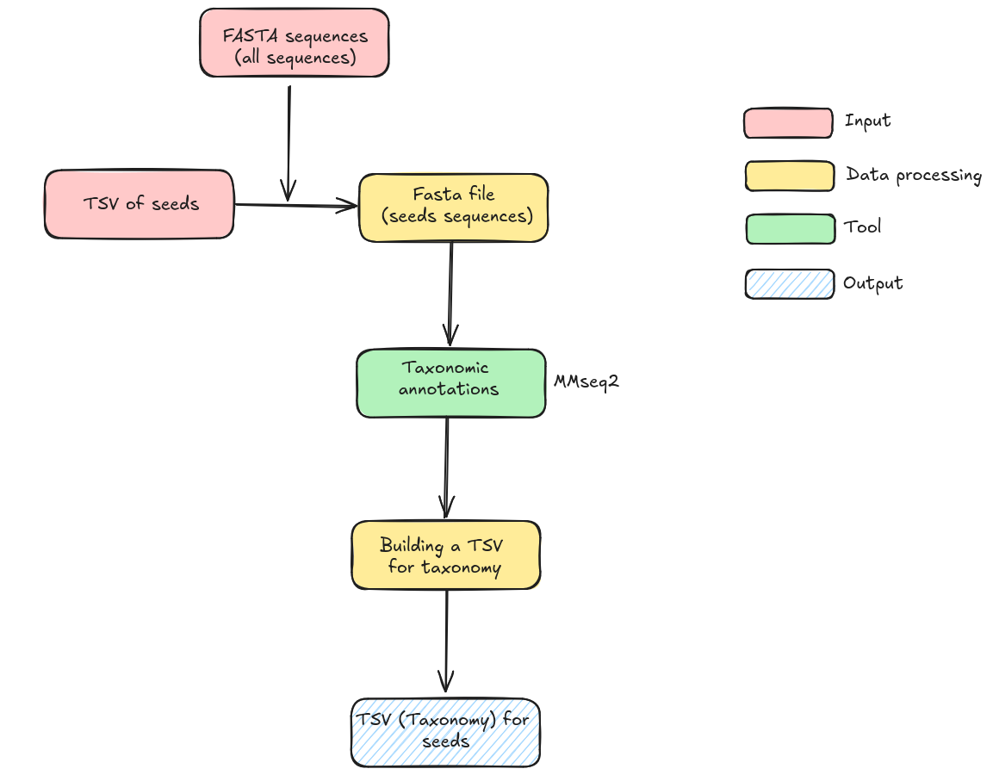

# 🎈 🎈 🎈 Welcome to the module number two ! 🎈 🎈 🎈 

This second module includes the assignement of viral taxonomy for representative contigs of each cluster (cf. module_01).

<p align="center">
  
</p>

## Requirements

First, you need to be sure that you have run the first module (module_01) to have a full access to data.

You will probably have to modify the paths in the scripts.


I suggest you to work on a HPC because this step can take a while...
For this module, you will need of some programs on your machine.

You will have to use seqtk tool.
```
conda env create -f seqtk_env.yml
conda activate seqtk_env
```


If you are not working on a HPC : 
We are using [MMseqs2](https://github.com/soedinglab/MMseqs2) Version: 24479bc27c3f33a3c0121f916038c605beef3e79.
```
# install by brew
brew install mmseqs2
# install via conda
conda install -c conda-forge -c bioconda mmseqs2
# install docker
docker pull ghcr.io/soedinglab/mmseqs2
# MMseqs2-GPU mostly-static AVX2 build requiring glibc >= 2.29 and nvidia driver >=525.60.13 (see below)
wget https://mmseqs.com/latest/mmseqs-linux-gpu.tar.gz; tar xvfz mmseqs-linux-gpu.tar.gz; export PATH=$(pwd)/mmseqs/bin/:$PATH
# static build with AVX2 (fastest)
wget https://mmseqs.com/latest/mmseqs-linux-avx2.tar.gz; tar xvfz mmseqs-linux-avx2.tar.gz; export PATH=$(pwd)/mmseqs/bin/:$PATH
# static build with SSE4.1
wget https://mmseqs.com/latest/mmseqs-linux-sse41.tar.gz; tar xvfz mmseqs-linux-sse41.tar.gz; export PATH=$(pwd)/mmseqs/bin/:$PATH
# static build with SSE2 (slowest, for very old systems)
wget https://mmseqs.com/latest/mmseqs-linux-sse2.tar.gz; tar xvfz mmseqs-linux-sse2.tar.gz; export PATH=$(pwd)/mmseqs/bin/:$PATH
```

I recommend you to have snakemake on your machine to run the pipeline automatically.
```
# If you don't have conda on your machine :
wget https://repo.anaconda.com/miniconda/Miniconda3-latest-Linux-x86_64.sh -O miniconda.sh
bash miniconda.sh
source ~/.bashrc

# When you have conda on your machine :
conda create -c conda-forge -n snakemake snakemake
conda activate snakemake
```
## Usage

I recommand you to follow the all-in-one steps. This option is running the entire module automatically. Make sure you have snakemake (cf. Requirements).
If you want to look after the different steps you can follow the step-by-step part (you don't need snakemake for this).

### Module all-in-one

faire snakemake XXXXXXXXXXXXXx 

### Module step-by-step

The **first** step is to create a viral database from RefSeq NCBI database !
```
./module_02/MMseq2/bin/crea_db.sh
sbatch -p fast -q fast module_02/MMseq2/bin/crea_db.slurm # WORKS ON HPC ONLY
```

The **second** step is to collect fasta sequences of representative contigs (cf. module_01) into one fasta file :
```
./module_02/MMseq2/bin/tax_fasta.sh
sbatch module_02/MMseq2/bin/tax_fasta.slurm # WORKS ON HPC ONLY
```
The **third** step is to do the taxonomic annotation !
```
./module_02/MMseq2/bin/taxo_annot.sh
sbatch module_02/MMseq2/bin/taxo_annot.slurm # WORKS ON HPC ONLY
```
The **fourth** step is to re-build the results from MMseq2 into a more readable and accessible table. And, during this step, you can create some figures.
```
./module_02/MMseq2/bin/building_res.py # re-Building results
./module_02/MMseq2/bin/sankey.sh # Create Sankey graph
```
