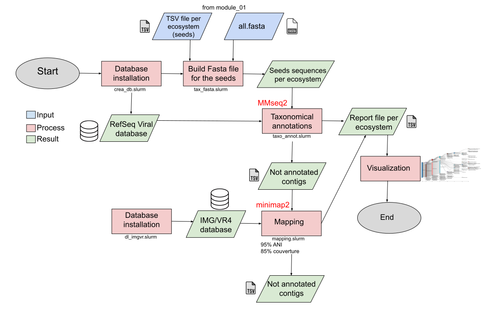

# 🎈 🎈 🎈 Welcome to the module number two ! 🎈 🎈 🎈 

This second module includes the assignement of viral taxonomy for representative contigs of each cluster (cf. module_01).

<p align="center">
  
</p>

## Requirements

First, you need to be sure that you have run the first module (module_01) to have a full access to data.

You will probably have to modify the paths in the scripts.


I suggest you to work on a HPC because this step can take a while...
For this module, you will need of some programs on your machine.

You will have to use seqtk tool.
```
conda env create -f seqtk_env.yml
conda activate seqtk_env
```


If you are not working on a HPC : 
We are using [MMseqs2](https://github.com/soedinglab/MMseqs2) Version: 24479bc27c3f33a3c0121f916038c605beef3e79.
```
# install by brew
brew install mmseqs2
# install via conda
conda install -c conda-forge -c bioconda mmseqs2
# install docker
docker pull ghcr.io/soedinglab/mmseqs2
# MMseqs2-GPU mostly-static AVX2 build requiring glibc >= 2.29 and nvidia driver >=525.60.13 (see below)
wget https://mmseqs.com/latest/mmseqs-linux-gpu.tar.gz; tar xvfz mmseqs-linux-gpu.tar.gz; export PATH=$(pwd)/mmseqs/bin/:$PATH
# static build with AVX2 (fastest)
wget https://mmseqs.com/latest/mmseqs-linux-avx2.tar.gz; tar xvfz mmseqs-linux-avx2.tar.gz; export PATH=$(pwd)/mmseqs/bin/:$PATH
# static build with SSE4.1
wget https://mmseqs.com/latest/mmseqs-linux-sse41.tar.gz; tar xvfz mmseqs-linux-sse41.tar.gz; export PATH=$(pwd)/mmseqs/bin/:$PATH
# static build with SSE2 (slowest, for very old systems)
wget https://mmseqs.com/latest/mmseqs-linux-sse2.tar.gz; tar xvfz mmseqs-linux-sse2.tar.gz; export PATH=$(pwd)/mmseqs/bin/:$PATH
```

```
# If you don't have conda on your machine :
wget https://repo.anaconda.com/miniconda/Miniconda3-latest-Linux-x86_64.sh -O miniconda.sh
bash miniconda.sh
source ~/.bashrc

# When you have conda on your machine :

conda env create -f module_02/env/sankey.yml
conda env create -f module_02/env/seqtk_env.yml
```

## Usage

#### The **first** step is to create a viral database from RefSeq NCBI database !
```
./module_02/MMseq2/bin/crea_db.sh
sbatch -p fast -q fast module_02/MMseq2/bin/crea_db.slurm # WORKS ON HPC ONLY
```
At the end of this step, you should have something like this :

```
huserville/module_02/MMseq2/taxonomy/mmseqs_vrefseq/
├── refseq_viral
│   ├── refseq_viral.dbtype
│   ├── refseq_viral.faa
│   ├── refseq_viral.idx
│   ├── refseq_viral.idx.dbtype
│   ├── refseq_viral.idx.index
│   ├── refseq_viral.index
│   ├── refseq_viral.lookup
│   ├── refseq_viral.source
├── refseq_viral_h
│   ├── refseq_viral_h.dbtype
│   ├── refseq_viral_h.index
├── refseq_viral_mapping
├── refseq_viral_merged.dmp
├── refseq_viral_names.dmp
├── refseq_viral_nodes.dmp
├── refseq_viral_taxonomy
└── virus.accession2taxid
```

#### The **second** step is to collect fasta sequences of representative contigs (cf. module_01) into one fasta file for each ecosystem :
```
sbatch -p fast -q fast module_02/MMseq2/bin/tax_fasta.slurm
```
For this script you will need the TSV file created by filtering.slurm in the module_01 AND the fasta file created during clustering in module_01.
At the end, you should have Fasta file for seeds for each ecosystem :
```
huserville/module_02/MMseq2/results/eco_fasta/
├── ecosystem_1_tax_fasta_seed.fa
├── ecosystem_2_tax_fasta_seed.fa
├── ecosystem_3_tax_fasta_seed.fa
├── ecosystem_4_tax_fasta_seed.fa
├── ecosystem_5_tax_fasta_seed.fa
├── ecosystem_6_tax_fasta_seed.fa
├── ecosystem_7_tax_fasta_seed.fa
├── ecosystem_8_tax_fasta_seed.fa
├── ecosystem_9_tax_fasta_seed.fa
└── ecosystem_10_tax_fasta_seed.fa
```

#### The **third** step is to do the taxonomic annotation !
```
./module_02/MMseq2/bin/taxo_annot.sh
sbatch module_02/MMseq2/bin/taxo_annot.slurm
OR IF ERROR
sbatch module_02/MMseq2/bin/taxo_annot2.slurm
```

At the end, the results should be like this :
```
huserville/module_02/MMseq2/results/eco_taxo/
├── ecosystem_1
│   ├── ecosystem_1_taxo_report
│   └── ecosystem_1_taxo_results.tsv
├── ecosystem_2
│   ├── ecosystem_2_taxo_report
│   └── ecosystem_2_taxo_results.tsv
└── ecosystem_3
    ├── ecosystem_3_taxo_report
    └── ecosystem_3_taxo_results.tsv
```

#### The **fourth** step is to re-build the results from MMseq2 into a more readable and accessible table. And, during this step, you can create some figures.
```
sbatch -p fast -q fast module_02/MMseq2/bin/building_res.slurm
sbatch -p fast -q fast module_02/MMseq2/bin/sankey.slurm
```
At the end, you will have rebuild TSV files for each ecosystem :
```
huserville/module_02/MMseq2/results/rebuild_taxo/
├── ecosystem_1_taxo_seeds.tsv
├── ecosystem_2_taxo_seeds.tsv
├── ecosystem_3_taxo_seeds.tsv
├── ecosystem_4_taxo_seeds.tsv
└── ecosystem_5_taxo_seeds.tsv
```
Each TSV file looks like this : 
| ID                       | Domain | Kingdom       | Phylum        | Class        | Order        | Family         | Genus         | Species                        |
|--------------------------|--------|---------------|---------------|--------------|--------------|----------------|---------------|--------------------------------|
| SRR6050921.k141_1088912   | Viruses| Loebvirae     | Hofneiviricota| Faserviricetes| Tubulavirales| Paulinoviridae | Thomixvirus   | Thomixvirus OH3               |
| SRR6051345.k141_332718    | Viruses| Heunggongvirae| Uroviricota   | Caudoviricetes| NA           | NA             | NA            | NA                             |
| SRR6051696.k141_277779    | Viruses| Heunggongvirae| Uroviricota   | Caudoviricetes| NA           | Peduoviridae   | NA            | NA                             |
| SRR6051700.k141_350581    | Viruses| Bamfordvirae  | Nucleocytoviricota | Megaviricetes | Imitervirales | Mimiviridae   | Rheavirus     | Rheavirus sinusmexicani       |
| SRR6051181.k141_988721    | Viruses| Heunggongvirae| Uroviricota   | Caudoviricetes| NA           | NA             | NA            | NA                             |
| SRR6050960.k141_147992    | Viruses| Heunggongvirae| Uroviricota   | Caudoviricetes| NA           | Peduoviridae   | NA            | NA                             |
| SRR6051345.k141_953503    | Viruses| NA            | NA            | NA           | NA           | NA             | NA            | NA                             |
| SRR6051612.k141_734555    | NA     | NA            | NA            | NA           | NA           | NA             | NA            | NA                             |
| SRR6050903.k141_1067346   | Viruses| Heunggongvirae| Uroviricota   | Caudoviricetes| NA           | NA             | NA            | NA                             |


#### The **fifth** step is to map the seed sequences on the [IMG/VR](https://academic.oup.com/nar/article/51/D1/D733/6833254?login=true) database.

Firstly, you have to make sure that you have an access to the IMG/VR database (file : IMGVR_all_nucleotides.fna.gz).
If not : I suggest you to read [this](https://genome.jgi.doe.gov/portal/help/download.jsf#/api).
You can also download the database by the following command but you need first a JGI IMG account. When you have the account, you can modify the slurm script to enter your 
own login and password.

This step is usefull to complete the NA from the previous taxonomic TSV file, by using another database.

```
sbatch -p fast -q fast module_02/minimap/bin/dl_imgvr.slurm
```
Once you have an access to the IMG/VR database. You are ready to map the seed sequences !

```
sbatch module_02/minimap/bin/mapping.slurm
```

Then, you can complete the taxonomic informations with IMG/VR database thanks to the mapping. You can do it for each ecosystem.
```
sbatch module_02/minimap/bin/complete_taxo.slurm
```

