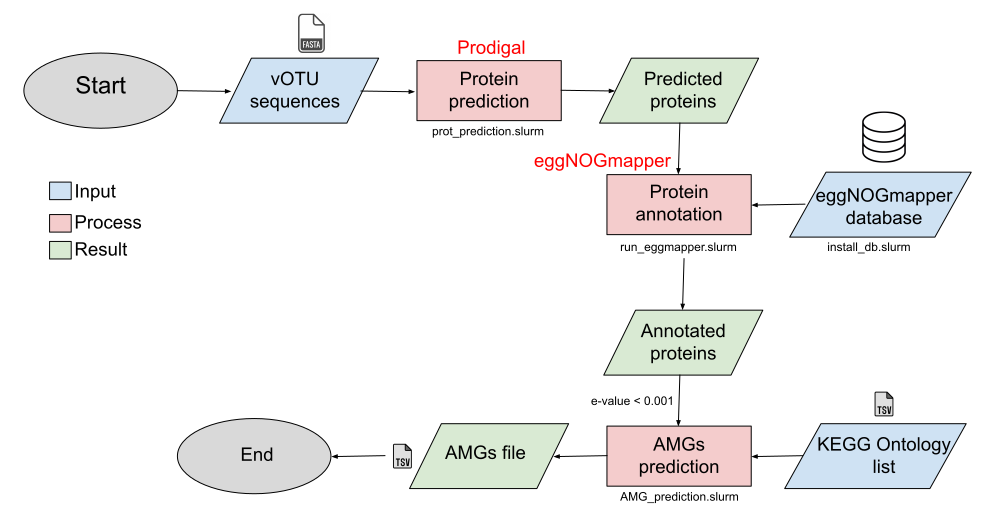

# 🎈 🎈 🎈 Welcome to the module number four ! 🎈 🎈 🎈

In this module, you are going to do some functionnal annotations of your vOTU sequences and you will predict the Auxilliary Metabolic Genes !

<p align="center">
  
</p>

## Requirements
To perform the functionnal annotation, we are using the eggNOGmapper tool. You can find more information [here](https://github.com/eggnogdb/eggnog-mapper/).
To use this tool, you need to install the conda environment : 

```
conda env create -f module_04/env/eggmapper.yml
```

You will need the fasta files of your vOTU sequences, created in module_02 : 
```
module_02/
    └── MMseq2/
        └── results/
            └── eco_fasta/
                ├── eco1_tax_fasta_seed.fa
                ├── eco2_tax_fasta_seed.fa
                ├── eco3_tax_fasta_seed.fa
                ├── eco4_tax_fasta_seed.fa
```

## Usage
#### The **first** step is to perform a protein prediction of your vOTU sequences.
This step using Prodigual [tool](https://github.com/hyattpd/Prodigal).
```
sbatch module_04/prodigal/bin/prot_prediction.slurm
```
#### The **second** step is do the functionnal annotation.
You need to install the database used by eggNOGmapper
```
sbatch module_04/eggmapper/bin/install_db.slurm
```
Then, you can use the tool to do the annotation :
```
sbatch module_04/eggmapper/bin/run_eggmapper.slurm
```
### The **Third** step is to collect the AMG from the annotations
```
sbatch module_04/eggmapper/bin/AMG_prediction.slurm
```


