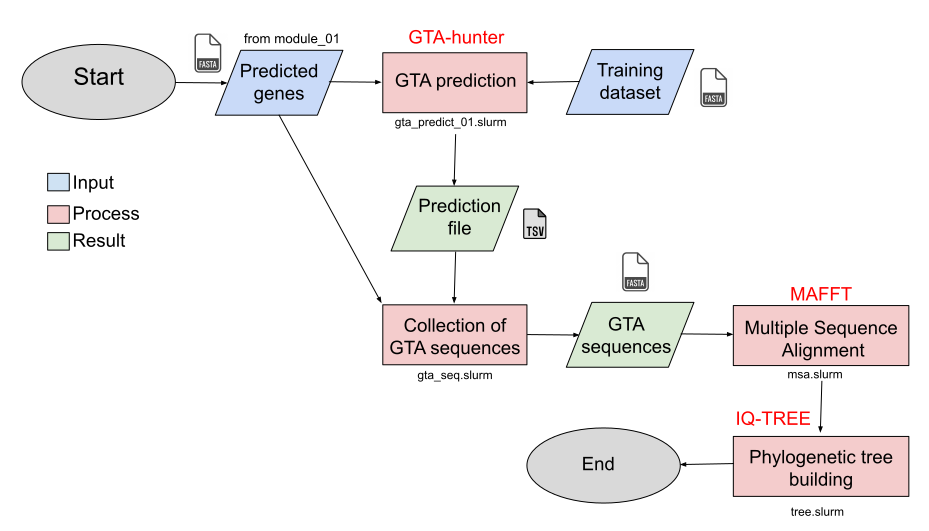

#       Welcome to the module number five !      

This module aims to predict the Gene Transfert Agents (GTAs) from all the viral sequences of the dataset.

<p align="center">
  
</p>

## Requirements
Firstly, you need to have the GTA_hunter bio-informatic tool. 
I suggest you to follow the next commands : 
```
git clone https://github.com/kogayr/GTA-Hunter.git
mv GTA-Hunter/ module_05/gta_hunter/bin/
```
Then, you need to have a specific conda environment to use all the depedencies of this tool :
```
conda env create -f module_05/gta_hunter/env/gta_hunter.yml
```

## Usage
#### The **first** step is to collect the prodigual gene predictions for your sequences. 

Note that CheckV (cf. module_01) is already performing a prodigual analysis. 
GTA-hunter needs the gene sequences to perform its prediction based on a dataset of genes from Rhodobacter capsulatus GTAs.
```
sbatch module_05/prodigual/bin/protein.slurm
```

#### The **second** step is to perform the GTAs predictions. 
Note that this step consume a LOT of RAM.
You need to work on a HPC.
```
sbatch module_05/gta_hunter/bin/gta_predict_01.slurm
```
You can rewrite the prediction results into a TSV file :
```
sbatch -p fast -q fast module_05/gta_hunter/bin/gta_building_res.slurm
```

#### The **third** step is to perform a Multiple Sequence Alignement (MSA) of the GTAs genes predicted and isolated.
We are here using MAFFT tool. You can retrieve more information about this tool [here](https://github.com/GSLBiotech/mafft).
```
# To collect the GTAs sequences into a FASTA format
sbatch -p fast -q fast module_05/mafft/bin/gta_seq.slurm

# To perform the MSA (MAFFT)
sbatch module_05/mafft/bin/msa.slurm
```

Optionnal : You can do some statistics and visualization on GTAs logs :
```
sbatch -p fast -q fast module_03/stat_05/bin/stat_05.slurm
```

#### The **fourth** step is to create a phylogenetic tree of the GTA sequences.

The tree is building thanks to [Iqtree](https://github.com/iqtree/iqtree2).

```
conda env create -f module_05/iqtree/env/iqtree.yml
sbatch module_05/iqtree/bin/tree.slurm
```

